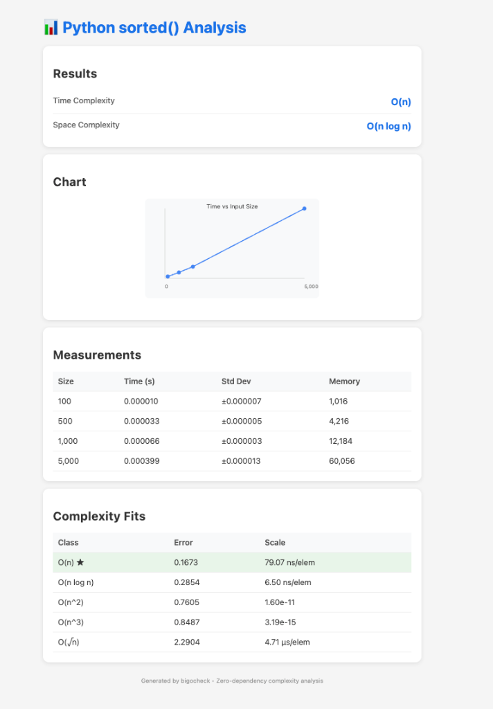

<!-- Author: gadwant -->
# bigocheck

> **The only zero-dependency, CLI-first Big-O complexity checker for Python**

Empirical complexity regression checker: run a target function across input sizes, measure runtimes, and fit against common complexity classes. Ships as both a library and CLI.

[](https://pypi.org/project/bigocheck/)
[](https://www.python.org/downloads/)
[](https://opensource.org/licenses/MIT)
[](https://pypi.org/project/bigocheck/)
[]()
[]()
[](https://app.codacy.com/gh/adwantg/bigocheck/dashboard?utm_source=gh&utm_medium=referral&utm_content=&utm_campaign=Badge_grade)
[]()
[](https://github.com/psf/black)

---

## 💡 TL;DR

**Problem**: You refactor some code and accidentally turn O(n) into O(n²), but your tests pass. It ships to production and slows down as data grows.

**Solution**: `bigocheck` empirically measures your function's time/space complexity across input sizes and alerts you *before* merge.

**Who**: Python developers who care about performance, maintainers of libraries/APIs, and teams running algorithmic code in production.

```python
from bigocheck import benchmark_function

def accidental_quadratic(n):
    result = []
    for x in range(n):
        if x not in result:  # 🐛 O(n) lookup on list!
            result.append(x)
    return result

analysis = benchmark_function(accidental_quadratic, sizes=[100, 1000, 5000])
print(analysis.best_label)  # O(n²) ⚠️ Regression detected!
```

**Key Value**:
- ✅ **Zero Dependencies** - No numpy, scipy, or matplotlib required
- ✅ **CLI-First** - Use in CI/CD without writing code
- ✅ **Production Ready** - 126/126 tests passing, v1.1.0

---

## 🎯 Core Features

| Feature | Description |
|---------|-------------|
| **🧮 Time Complexity** | Fits to 9 classes: O(1), O(log n), O(√n), O(n), O(n log n), O(n²), O(n³), O(2ⁿ), O(n!) |
| **📐 Space Complexity** | Classifies memory usage to complexity classes |
| **⚠️ Instability Detection** | Detect noisy/unreliable benchmark results |
| **🚨 Threshold Alerts** | Alert when complexity exceeds threshold (CI/CD) |
| **🔄 Regression Detection** | CLI: `bigocheck regression --baseline file.json` |
| **📤 CSV/JSON Export** | Export results to CSV, JSON, markdown |
| **💻 CLI-First** | Full command-line interface |
| **📦 Zero Dependencies** | Pure standard library, no numpy required |
| **✅ Complexity Assertions** | `@assert_complexity("O(n)")` decorator |
| **⚙️ GitHub Actions** | Pre-built CI workflow template |

<details>
<summary><b>🔧 See All 25+ Advanced Features</b></summary>

| Feature | Description |
|---------|-------------|
| **📏 Polynomial Fitting** | Detect O(n^k) for arbitrary k (e.g., O(n^2.34)) |
| **🔀 Git Commit Tracking** | Track complexity across commits, binary search for regression |
| **🏷️ Badge Generation** | SVG badges for READMEs (color-coded by complexity) |
| **📓 Jupyter Integration** | Rich HTML display in notebooks |
| **📖 Complexity Explanations** | Human-readable explanations of what O(n log n) means |
| **📏 Input Size Recommendations** | Smart input size suggestions for better benchmarks |
| **🏆 Multi-Algorithm Comparison** | Compare N algorithms at once with rankings |
| **📐 Bounds Checking** | Assert O(log n) ≤ f ≤ O(n²) ranges |
| **⚙️ Benchmark Profiles** | Presets: fast, balanced, accurate, thorough |
| **📝 Auto Documentation** | Auto-generate docstrings with complexity info |
| **📊 Statistical Significance** | P-values to validate complexity classification |
| **📉 Best/Worst/Avg Cases** | Analyze with sorted, reversed, and random inputs |
| **⚡ Async Support** | Benchmark `async def` functions |
| **📊 Amortized Analysis** | Track complexity over sequences of operations |
| **🚀 Parallel Benchmarking** | Run sizes in parallel for faster results |
| **📑 HTML Reports** | Generate beautiful HTML reports with SVG charts |
| **💻 Interactive REPL** | CLI: `bigocheck repl` for quick analysis |
| **🔍 Bounds Verification** | `verify_bounds()` to check expected complexity |
| **📊 Confidence Scoring** | Know how reliable your results are |
| **🔀 A/B Comparison** | Compare two implementations head-to-head |
| **📄 Report Generation** | Generate markdown reports automatically |
| **🔧 pytest Plugin** | Integration with pytest for testing |
| **📈 Plotting** | Optional matplotlib visualization |
| **💾 Memory Profiling** | Track peak memory usage with `--memory` flag |
| **🚀 Auto Size Selection** | Automatically choose optimal input sizes |

</details>


---

## 📦 Installation

```bash
pip install bigocheck
```

### Development Install
```bash
python -m venv .venv
source .venv/bin/activate
pip install -e '.[dev]'
```

---

---

## 🚀 Quick Start

### 🏃 Examples

Running the full feature demo:
```bash
python examples/demo.py
```

### 📊 Example Output

```python
from bigocheck import benchmark_function, compute_confidence

def process_data(n):
    # Accidental O(n^2) - using 'in' on a list inside the loop
    result = []
    for item in range(n):
        if item not in result:
            result.append(item)
    return result

analysis = benchmark_function(process_data, sizes=[100, 500, 1000])
confidence = compute_confidence(analysis)
print(f"Complexity: {analysis.best_label}")
print(f"Confidence: {confidence.level} ({confidence.score:.0%})")
```

**Output**:
```
Benchmarking process_data...
  Size 100: 0.0012s
  Size 500: 0.0284s  
  Size 1000: 0.1139s

Complexity: O(n^2)
Confidence: high (90%)
⚠️ Warning: Quadratic complexity detected!
```


### CLI Usage

```bash
# Basic benchmark
bigocheck run --target mymodule:myfunc --sizes 100 500 1000 --trials 3

# With warmup and verbose output
bigocheck run --target mymodule:myfunc --sizes 100 500 1000 --warmup 2 --verbose

# Output as JSON for CI/CD
bigocheck run --target mymodule:myfunc --sizes 100 500 1000 --json
```

### Library Usage

```python
from bigocheck import benchmark_function

def my_func(n):
    return sum(range(n))

analysis = benchmark_function(my_func, sizes=[100, 500, 1000])
print(f"Best fit: {analysis.best_label}")  # 'O(n)'
```

---

## 📚 Feature Guide

### 1️⃣ Basic Benchmarking

Measure a function's complexity across input sizes.

```python
from bigocheck import benchmark_function

def bubble_sort(n):
    arr = list(range(n, 0, -1))
    for i in range(len(arr)):
        for j in range(len(arr) - 1):
            if arr[j] > arr[j + 1]:
                arr[j], arr[j + 1] = arr[j + 1], arr[j]
    return arr

analysis = benchmark_function(bubble_sort, sizes=[100, 200, 400, 800], trials=2)
print(f"Best fit: {analysis.best_label}")  # O(n^2)

for fit in analysis.fits[:3]:
    print(f"  {fit.label}: error={fit.error:.4f}")
```

---

### 2️⃣ Complexity Assertions (CI/CD Testing)

Use `assert_bounds()` as the default guardrail for real-world CI, and `assert_complexity()` when you want an exact target class.

```python
from bigocheck import assert_bounds, assert_complexity, ComplexityAssertionError

@assert_bounds(lower="O(1)", upper="O(n)", profile="ci")
def linear_sum(n):
    return sum(range(n))

# First call triggers verification
linear_sum(10)  # Passes silently

# Use assert_complexity when you need an exact class
@assert_complexity("O(n)", profile="ci")
def exact_linear(n):
    return sum(range(n))

# If complexity is wrong, raises ComplexityAssertionError
@assert_complexity("O(1)", profile="ci")  # Wrong!
def actually_linear(n):
    return sum(range(n))

try:
    actually_linear(10)
except ComplexityAssertionError as e:
    print(f"Caught: {e}")
```

---

### 3️⃣ Bounds Verification

Verify complexity without decorators.

```python
from bigocheck import verify_bounds

def my_sort(arr):
    return sorted(arr)

# Verify using wrapper
def test_wrapper(n):
    return my_sort(list(range(n)))

result = verify_bounds(test_wrapper, sizes=[1000, 5000, 10000], expected="O(n log n)")

if result.passes:
    print(f"✓ Verified: {result.expected}")
else:
    print(f"✗ Expected {result.expected}, got {result.actual}")
    
print(f"Confidence: {result.confidence} ({result.confidence_score:.0%})")
```

---

### 4️⃣ Confidence Scoring

Know how reliable your results are.

```python
from bigocheck import benchmark_function, compute_confidence

analysis = benchmark_function(my_func, sizes=[100, 500, 1000, 5000, 10000])
confidence = compute_confidence(analysis)

print(f"Confidence: {confidence.level} ({confidence.score:.0%})")
print("Reasons:")
for reason in confidence.reasons:
    print(f"  - {reason}")
```

Output:
```
Confidence: high (85%)
Reasons:
  - Clear gap between fits (0.234)
  - Low best-fit error (0.012)
  - Good measurement count (5)
  - Good size spread (ratio 100.0)
```

---

### 5️⃣ A/B Comparison

Compare two implementations head-to-head.

```python
from bigocheck import compare_functions

def linear_search(n):
    arr = list(range(n))
    return n - 1 in arr

def binary_search(n):
    arr = list(range(n))
    target = n - 1
    lo, hi = 0, len(arr) - 1
    while lo <= hi:
        mid = (lo + hi) // 2
        if arr[mid] == target:
            return True
        elif arr[mid] < target:
            lo = mid + 1
        else:
            hi = mid - 1
    return False

result = compare_functions(
    linear_search,
    binary_search,
    sizes=[1000, 5000, 10000, 50000],
)

print(result.summary)
# "binary_search is 15.23x faster than linear_search overall (4/4 sizes)"

print(f"Complexities: {result.func_a_label} vs {result.func_b_label}")
# "Complexities: O(n) vs O(log n)"
```

---

### 6️⃣ Report Generation

Generate beautiful markdown reports.

```python
from bigocheck import benchmark_function, generate_report, save_report

analysis = benchmark_function(my_func, sizes=[100, 500, 1000, 5000])
report = generate_report(analysis, title="My Analysis Report")

print(report)  # Print to console
save_report(report, "analysis_report.md")  # Save to file
```

**Comparison reports:**
```python
from bigocheck import compare_functions, generate_comparison_report

result = compare_functions(func_a, func_b, sizes=[100, 500, 1000])
report = generate_comparison_report(result)
save_report(report, "comparison.md")
```

**Verification reports:**
```python
from bigocheck import verify_bounds, generate_verification_report

result = verify_bounds(my_func, sizes=[100, 500], expected="O(n)")
report = generate_verification_report(result)
```

---

### 7️⃣ Auto Size Selection

Let bigocheck choose optimal input sizes automatically.

```python
from bigocheck import auto_select_sizes, benchmark_function

# Automatically find good sizes
sizes = auto_select_sizes(my_func, target_time=3.0, min_sizes=5)
print(f"Selected sizes: {sizes}")

# Use the auto-selected sizes
analysis = benchmark_function(my_func, sizes=sizes)
```

---

### 8️⃣ pytest Integration

Use the pytest plugin for test defaults and suite-level reporting.

```python
import pytest

pytest_plugins = ["bigocheck.pytest_plugin"]


@pytest.mark.complexity("O(n)", profile="ci", space_upper="O(n)")
def test_with_marker_defaults(complexity_checker):
    def my_func(n):
        return [0] * n

    result = complexity_checker.check(my_func)
    assert result.passes, result.message

def test_with_explicit_bounds(complexity_checker):
    def my_func(n):
        return sum(range(n))

    complexity_checker.assert_bounds(my_func, upper="O(n)")
```

```bash
pytest -q --bigocheck-report .artifacts/bigocheck-report.json
```

---

### 9️⃣ Data Generators

Use built-in data generators for testing.

```python
from bigocheck import benchmark_function
from bigocheck.datagen import integers, sorted_integers, arg_factory_for

def my_sort(arr):
    return sorted(arr)

# Benchmark with random integer lists
analysis = benchmark_function(
    my_sort,
    sizes=[1000, 5000, 10000],
    arg_factory=arg_factory_for(integers),
)
```

If object construction should be excluded from the timed region, use `setup=` instead:

```python
analysis = benchmark_function(
    my_sort,
    sizes=[1000, 5000, 10000],
    setup=lambda n: ((integers(n),), {}),
)
```

**Available generators:**

| Generator | Description |
|-----------|-------------|
| `n_(n)` | Returns N itself |
| `range_n(n)` | Returns `range(n)` |
| `integers(n, lo, hi)` | Random integers |
| `floats(n, lo, hi)` | Random floats |
| `strings(n, length)` | Random strings |
| `sorted_integers(n)` | Sorted random integers |
| `reversed_integers(n)` | Reverse-sorted integers |

---

### 🔟 Memory & Space Complexity

Track memory usage and automatically classify space complexity.

```bash
bigocheck run --target mymodule:myfunc --sizes 1000 5000 10000 --memory
```

**Example Output:**
```
Time Complexity:  O(n)
Space Complexity: O(n)

Measurements:
  n=1000     time=0.001234s ±0.000001s  mem=81,920B
  n=5000     time=0.006789s ±0.000005s  mem=409,600B
  n=10000    time=0.012345s ±0.000012s  mem=819,200B
```

**Library Usage:**
```python
analysis = benchmark_function(my_func, sizes=[1000, 5000, 10000], memory=True)

print(f"Time Complexity:  {analysis.best_label}")
print(f"Space Complexity: {analysis.space_label}")

for m in analysis.measurements:
    print(f"n={m.size}: {m.seconds:.4f}s, memory={m.memory_bytes:,} bytes")
```

---

### 1️⃣1️⃣ Plotting (Optional)

Requires matplotlib: `pip install matplotlib`

```python
from bigocheck import benchmark_function
from bigocheck.plotting import plot_analysis, plot_all_fits

analysis = benchmark_function(my_func, sizes=[100, 500, 1000, 5000])

# Plot best fit
plot_analysis(analysis, title="My Analysis")

# Plot all complexity curves
plot_all_fits(analysis, save_path="all_fits.png", show=False)
```

---
### 1️⃣2️⃣ Polynomial Fitting

Detect O(n^k) for arbitrary k values.

```python
from bigocheck import benchmark_function, fit_polynomial

def my_func(n):
    return sum(i * i for i in range(n))

analysis = benchmark_function(my_func, sizes=[100, 500, 1000, 5000])
poly = fit_polynomial(analysis.measurements)

print(f"Detected: {poly.label}")      # e.g., "O(n^1.23)"
print(f"Exponent: {poly.exponent:.2f}")  # 1.23
print(f"Error: {poly.error:.4f}")
```

---

### 1️⃣3️⃣ Statistical Significance

Get p-values to validate complexity classification.

```python
from bigocheck import benchmark_function, compute_significance

analysis = benchmark_function(my_func, sizes=[100, 500, 1000, 5000, 10000])
sig = compute_significance(analysis)

print(f"p-value: {sig.p_value:.4f}")
print(f"Significant: {sig.is_significant}")  # True if p < 0.05
print(f"Confidence: {sig.confidence_level}")  # "high", "medium", "low"
```

---

### 1️⃣4️⃣ Regression Detection (CI/CD)

Save baselines and detect performance regressions.

**CLI:**
```bash
# Save a baseline
bigocheck run --target mymodule:myfunc --sizes 100 500 1000 --save-baseline baseline.json

# Check for regressions
bigocheck regression --target mymodule:myfunc --baseline baseline.json
```

**Library:**
```python
from bigocheck import benchmark_function, save_baseline, load_baseline, detect_regression

# Save baseline
analysis = benchmark_function(my_func, sizes=[100, 500, 1000])
save_baseline(analysis, "baseline.json", name="v1.0")

# Later: detect regressions
current = benchmark_function(my_func, sizes=[100, 500, 1000])
baseline = load_baseline("baseline.json")
result = detect_regression(current, baseline, time_threshold=0.2)

if result.has_regression:
    print(f"❌ REGRESSION: {result.message}")
else:
    print("✅ No regression")
```

---

### 1️⃣5️⃣ Best/Worst/Average Case Analysis

Test performance with different input arrangements.

```python
from bigocheck import analyze_cases

def my_sort(arr):
    return sorted(arr)

result = analyze_cases(my_sort, sizes=[1000, 5000, 10000])

print(result.summary)
# Case Analysis Summary:
#   Best case:    best - O(n log n)
#   Worst case:   worst - O(n log n)
#   Average case: average - O(n log n)

print(f"Best:  {result.best_case.time_complexity}")
print(f"Worst: {result.worst_case.time_complexity}")
```

---

### 1️⃣6️⃣ Async Function Support

Benchmark `async def` functions.

```python
import asyncio
from bigocheck import run_benchmark_async, benchmark_async

async def fetch_data(n):
    await asyncio.sleep(0.001 * n)
    return list(range(n))

# Synchronous wrapper (easier)
analysis = run_benchmark_async(fetch_data, sizes=[10, 50, 100])
print(f"Complexity: {analysis.best_label}")

# Or use async directly
async def main():
    analysis = await benchmark_async(fetch_data, sizes=[10, 50, 100])
    print(f"Complexity: {analysis.best_label}")

asyncio.run(main())
```

---

### 1️⃣7️⃣ Amortized Analysis

Analyze complexity over sequences of operations.

```python
from bigocheck import analyze_amortized

# Example: dynamic array append
data = []
def append_op():
    data.append(len(data))

result = analyze_amortized(append_op, n_operations=1000)

print(result.summary)
print(f"Amortized: {result.amortized_complexity}")
print(f"Total time: {result.total_time:.6f}s")
print(f"Per operation: {result.amortized_time:.9f}s")
```

---

### 1️⃣8️⃣ Parallel Benchmarking

Run benchmarks faster using parallel execution.

```python
from bigocheck import benchmark_parallel, benchmark_function
import time

def slow_func(n):
    time.sleep(0.01)
    return sum(range(n))

# Sequential (slower)
start = time.time()
analysis = benchmark_function(slow_func, sizes=[100, 500, 1000, 5000], trials=1)
print(f"Sequential: {time.time() - start:.2f}s")

# Parallel (faster)
start = time.time()
analysis = benchmark_parallel(slow_func, sizes=[100, 500, 1000, 5000], trials=1)
print(f"Parallel: {time.time() - start:.2f}s")
```

---

### 1️⃣9️⃣ HTML Reports

Generate beautiful HTML reports with SVG charts.

**CLI:**
```bash
bigocheck run --target mymodule:myfunc --sizes 100 500 1000 --html report.html
```

**Library:**
```python
from bigocheck import benchmark_function, generate_html_report, save_html_report

analysis = benchmark_function(my_func, sizes=[100, 500, 1000, 5000], memory=True)
html = generate_html_report(analysis, title="My Analysis")
save_html_report(html, "report.html")
```

**Example Output:**



---

### 2️⃣0️⃣ Interactive REPL

Quick analysis from the command line.

**CLI:**
```bash
bigocheck repl
```

**Output:**
```
╔══════════════════════════════════════════════════════════════════╗
║  bigocheck Interactive Mode                                       ║
║  Zero-dependency complexity analysis                              ║
╠══════════════════════════════════════════════════════════════════╣
║  Quick start:                                                     ║
║  >>> def my_func(n): return sum(range(n))                        ║
║  >>> a = benchmark_function(my_func, sizes=[100, 500, 1000])     ║
║  >>> print(a.best_label)                                         ║
╚══════════════════════════════════════════════════════════════════╝
>>> 
```

**One-liner complexity check:**
```python
from bigocheck import quick_check

result = quick_check(lambda n: sum(range(n)))
print(result)  # "O(n)"
```

---

### 2️⃣1️⃣ Git Commit Tracking

Track complexity changes across git commits.

```python
from bigocheck import track_commits, find_regression_commit

# Track across specific commits
result = track_commits(
    target="mymodule:myfunc",
    commits=["v1.0", "v1.5", "v2.0"],
    sizes=[100, 500, 1000],
)

print(result.summary)
# Tracked 3 commits:
#   abc1234: O(n) (Initial implementation...)
#   def5678: O(n) (Optimized loop...)
#   ghi9012: O(n^2) (Added feature X...)
#
# ❌ Regression detected at ghi9012:
#    O(n) → O(n^2)

# Binary search for exact regression commit
bad_commit = find_regression_commit(
    target="mymodule:myfunc",
    good_commit="v1.0",
    bad_commit="v2.0",
    sizes=[100, 500, 1000],
)
print(f"First bad commit: {bad_commit}")
```

---

### 2️⃣2️⃣ Instability Detection

Detect when benchmark results are unreliable.

```python
from bigocheck import benchmark_function, compute_stability, format_stability

analysis = benchmark_function(my_func, sizes=[100, 500, 1000], trials=5)
stability = compute_stability(analysis)

print(format_stability(stability))
# Stability: ✓ Stable (90%)
#
# Warnings:
#   ⚠️ Some variance detected in 1 measurements

if stability.is_unstable:
    print("⚠️ Results may be unreliable!")
    for warning in stability.warnings:
        print(f"  - {warning}")
    for rec in stability.recommendations:
        print(f"  → {rec}")
```

---

### 2️⃣3️⃣ Badge Generation

Generate SVG badges for your README.

```python
from bigocheck import benchmark_function, generate_badge, save_badge

analysis = benchmark_function(my_func, sizes=[100, 500, 1000])

# Generate and save SVG badge
badge = generate_badge(analysis.best_label)  # Color-coded by complexity
save_badge(badge, "docs/complexity_badge.svg")
```

**Color Coding:**
| Complexity | Color |
|------------|-------|
| O(1) | 🟢 Green |
| O(log n) | 🟢 Light Green |
| O(n) | 🟡 Yellow |
| O(n log n) | 🟠 Orange |
| O(n²) | 🔴 Red |
| O(n³+) | 🔴 Dark Red |

**Use in README:**
```markdown

```

**Or use shields.io URL:**
```python
from bigocheck import generate_badge_url

url = generate_badge_url("O(n log n)")
# https://img.shields.io/badge/complexity-O%28n%20log%20n%29-fe7d37
```

---

### 2️⃣4️⃣ Jupyter Integration

Rich HTML display in Jupyter notebooks.

```python
from bigocheck import benchmark_function, enable_jupyter_display

# Enable rich display (call once)
enable_jupyter_display()

# Now Analysis objects render as rich HTML
analysis = benchmark_function(my_func, sizes=[100, 500, 1000])
analysis  # Shows rich HTML in Jupyter

# Or display explicitly
from bigocheck import display_analysis, display_comparison

display_analysis(analysis)

# Compare multiple algorithms
display_comparison({
    "bubble_sort": analysis1,
    "quick_sort": analysis2,
})
```

---

### 2️⃣5️⃣ CSV/JSON Export

Export results to various formats.

```python
from bigocheck import benchmark_function, to_csv, to_json, to_markdown_table

analysis = benchmark_function(my_func, sizes=[100, 500, 1000])

# Export to CSV
csv_str = to_csv(analysis, "results.csv")

# Export to JSON
json_str = to_json(analysis, "results.json")

# Export as markdown table
md = to_markdown_table(analysis)
print(md)
# **Time Complexity:** O(n)
# 
# | Size | Time (s) | Std Dev | Memory |
# |------|----------|---------|--------|
# | 100 | 0.000010 | ±0.000001 | - |
```

---

### 2️⃣6️⃣ Threshold Alerts

Alert when complexity exceeds acceptable thresholds (great for CI/CD).

```python
from bigocheck import check_threshold, assert_threshold, monitor_complexity

analysis = benchmark_function(my_func, sizes=[100, 500, 1000])

# Check against threshold
result = check_threshold(analysis, max_complexity="O(n log n)")
if not result.passed:
    print(f"❌ {result.message}")

# Use as decorator
@assert_threshold("O(n)")
def my_algorithm(n):
    return sum(range(n))

my_algorithm(100)  # Raises ComplexityThresholdError if O(n) exceeded

# Monitor with warnings
analysis = monitor_complexity(
    my_func,
    sizes=[100, 500, 1000],
    max_complexity="O(n)",
    on_exceed="warn"  # or "error" or "ignore"
)
```

---

### 2️⃣7️⃣ Complexity Explanations

Get human-readable explanations of complexity classes.

**CLI:**
```bash
bigocheck explain "O(n log n)"
```

**Library:**
```python
from bigocheck import explain_complexity

print(explain_complexity("O(n log n)"))
```

**Output:**
```
O(n log n) - Linearithmic

Description: Slightly more than linear, common in efficient sorting.
Example: Merge sort, heap sort, quick sort (average)
Scaling: Good - optimal for comparison-based sorting
Real World: Sorting a playlist by song name
```

---

### 2️⃣8️⃣ Input Size Recommendations

Get smart suggestions for input sizes based on function speed.

**CLI:**
```bash
bigocheck recommend --target mymodule:my_func
```

**Library:**
```python
from bigocheck import suggest_sizes, format_recommendation

rec = suggest_sizes(my_func, time_budget=1.0)
print(format_recommendation(rec))
```

**Output:**
```
Input Size Recommendation
========================
Sizes: [1000, 2500, 5000, 10000, 25000, 50000, 100000]
Reason: Very fast function - using larger input sizes.
Estimated Time: 0.4s
Confidence: high
```

---

### 2️⃣9️⃣ Multi-Algorithm Comparison

Compare multiple algorithms at once and rank them.

**CLI:**
```bash
bigocheck compare --targets mymodule:bubble_sort mymodule:quick_sort --sizes 100 500 1000
```

**Library:**
```python
from bigocheck import compare_algorithms

result = compare_algorithms(
    {"bubble_sort": bubble_sort, "quick_sort": quick_sort},
    sizes=[100, 500, 1000],
)
print(result.summary_table)
```

**Output:**
```
Algorithm Comparison Summary
======================================================================

Rank   Algorithm            Time Complexity Avg Time    
----------------------------------------------------------------------
🥇 1   quick_sort           O(log n)        0.000002s
🥈 2   bubble_sort          O(n^2)          0.000649s

Winner (by complexity): quick_sort (O(log n))
```

---

### 3️⃣0️⃣ Bounds Checking

Assert that complexity falls within a specific range (e.g., at least O(1) but no worse than O(n)).

```python
from bigocheck import check_bounds, assert_bounds

# Manual check
result = check_bounds(analysis, lower="O(1)", upper="O(n)")
print(result.message)
# ✓ Complexity in bounds: O(1) ≤ O(log n) ≤ O(n)

# Decorator assertion
@assert_bounds(lower="O(1)", upper="O(n)")
def fast_func(n):
    return sum(range(n))
```

---

### 3️⃣1️⃣ Benchmark Profiles

Use preset configurations for common scenarios.

```python
from bigocheck import benchmark_with_profile, profile_decorator

# Use a preset profile
analysis = benchmark_with_profile(my_func, profile="accurate")
# Profiles: fast, balanced, accurate, thorough, large, small, ci

# Decorator usage
@profile_decorator("fast")
def check_me(n):
    pass

check_me(100)  # Prints: 📊 check_me: O(1)
```

`profile="ci"` is the recommended default for automated checks: larger sizes, more trials, warmup, and robust aggregation.

---

### 3️⃣2️⃣ Auto Documentation

Automatically generate docstrings with empirical complexity.

```python
from bigocheck import document_complexity

@document_complexity()
def my_sort(n):
    """Sorts a list of n elements."""
    return sorted(range(n))

my_sort(100)  # Runs benchmark on first call
print(my_sort.__doc__)
```

**Output:**
```
Sorts a list of n elements.

Complexity:
    Time: O(n log n)

Note:
    Complexity measured empirically by bigocheck.
```

---

### 3️⃣3️⃣ Hybrid AI-Assisted Analysis

Combine empirical measurements with static AST analysis (loops/recursion counting) for hybrid verification.

```python
from bigocheck import predict_complexity, verify_hybrid, benchmark_function

def fast_func(n):
    for i in range(n):
        pass

# 1. Static Prediction (Zero-Runtime)
prediction = predict_complexity(fast_func)
print(f"Predicted: {prediction['prediction']}")  # "O(n)"
print(f"Reason:    {prediction['reason']}")      # "Single loop detected"

# 2. Hybrid Verification (Compare Static vs Dynamic)
analysis = benchmark_function(fast_func, sizes=[100, 1000])
result = verify_hybrid(fast_func, analysis.best_label)
print(result) # "✅ Match! Static (O(n)) aligns with Empirical (O(n))"
```

---

### 3️⃣4️⃣ Static Web Dashboard

Generate a self-contained HTML dashboard folder to host on GitHub Pages.

```python
from bigocheck import benchmark_function, generate_dashboard

# Run multiple benchmarks
b1 = benchmark_function(func1, sizes=[100, 1000])
b2 = benchmark_function(func2, sizes=[100, 1000])

# Generate static site
generate_dashboard([b1, b2], output_dir="docs/dashboard")
# ✅ Dashboard generated at: docs/dashboard/index.html
```

---

### 3️⃣5️⃣ Cloud Runner Generator

Generate a GitHub Actions workflow to run benchmarks in the cloud (consistent hardware).

```python
from bigocheck import generate_github_action

# Creates .github/workflows/bigocheck_benchmark.yml
generate_github_action()
```

---
## 🖥️ CLI Reference

```bash
bigocheck run --target MODULE:FUNC --sizes N1 N2 N3 [OPTIONS]
bigocheck regression --target MODULE:FUNC --baseline FILE [OPTIONS]
bigocheck repl
bigocheck explain "COMPLEXITY"
bigocheck recommend --target MODULE:FUNC [OPTIONS]
bigocheck compare --targets M:F1 M:F2 --sizes N1 N2 [OPTIONS]
bigocheck dashboard --targets M:F1 M:F2 --output DIR [OPTIONS]
bigocheck cloud
```

| Option | Description |
|--------|-------------|
| `--target` | Import path `module:func` (required) |
| `--sizes` | Input sizes to test (required for `run`) |
| `--trials` | Runs per size, averaged (default: 3) |
| `--warmup` | Warmup runs before timing (default: 0) |
| `--verbose`, `-v` | Show progress |
| `--memory` | Track memory usage |
| `--json` | JSON output for CI/CD |
| `--plot` | Show plot (requires matplotlib) |
| `--plot-save PATH` | Save plot to file |
| `--html PATH` | Generate HTML report |
| `--save-baseline PATH` | Save baseline for regression detection |
| `--baseline PATH` | Baseline file for regression check |
| `--threshold` | Slowdown threshold for regression (default: 0.2) |
| `--time-budget` | Time budget for size recommendation (default: 5.0) |
| `--targets` | List of targets for comparison/dashboard (required) |
| `--output` | Output directory for dashboard (default: dashboard) |
| `--sizes` | Sizes (optional for dashboard/regression) |

---

## 🧮 Supported Complexity Classes

| Class | Notation | Example Use Case |
|-------|----------|------------------|
| Constant | O(1) | Hash table lookup |
| Logarithmic | O(log n) | Binary search |
| Square Root | O(√n) | Prime checking |
| Linear | O(n) | Linear search |
| Linearithmic | O(n log n) | Efficient sorting |
| Quadratic | O(n²) | Bubble sort |
| Cubic | O(n³) | Matrix multiplication |
| Exponential | O(2ⁿ) | Naive Fibonacci |
| Factorial | O(n!) | Permutations |
| **Polynomial** | O(n^k) | Detected via `fit_polynomial()` |

---

## 🔧 API Reference

### Core Functions

```python
from bigocheck import (
    # Core
    benchmark_function,    # Main benchmarking function
    fit_complexities,      # Fit measurements to complexity classes
    fit_space_complexity,  # Fit memory to complexity classes
    complexity_basis,      # Get all complexity basis functions
    
    # Assertions
    assert_complexity,     # Decorator for complexity assertions
    verify_bounds,         # Verify against expected complexity
    compute_confidence,    # Compute confidence score
    auto_select_sizes,     # Auto-select optimal sizes
    
    # Comparison
    compare_functions,     # A/B comparison
    compare_algorithms,    # Multi-algorithm comparison
    
    # Reports
    generate_report,       # Generate markdown report
    save_report,           # Save markdown report
    generate_html_report,  # Generate HTML report
    
    # New Features (v0.7.0)
    explain_complexity,    # Explain complexity class
    suggest_sizes,         # Recommend input sizes
    check_bounds,          # Check complexity bounds
    benchmark_with_profile,# Run with preset profile
    document_complexity,   # Auto-document complexity
    
    # Jupyter
    enable_jupyter_display, # Enable rich notebook display
    display_analysis,       # Display analysis object
    
    # Export
    to_csv,
    to_json,
    to_markdown_table,
    
    # Alerts
    check_threshold,
    assert_threshold,
    monitor_complexity,
    compare_to_baseline,   # Compare to baseline complexity
    
    # Reports (Markdown)
    generate_report,       # Generate markdown report
    generate_comparison_report,
    generate_verification_report,
    save_report,
    
    # Reports (HTML)
    generate_html_report,  # Generate HTML report with charts
    save_html_report,
    
    # Statistics
    compute_significance,  # P-values for classification
    SignificanceResult,
    
    # Regression Detection
    save_baseline,         # Save baseline JSON
    load_baseline,         # Load baseline JSON
    detect_regression,     # Detect regressions
    Baseline,
    RegressionResult,
    
    # Case Analysis
    analyze_cases,         # Best/worst/avg case
    CasesAnalysis,
    CaseResult,
    
    # Polynomial Fitting
    fit_polynomial,        # Detect O(n^k)
    fit_polynomial_space,
    PolynomialFit,
    
    # Async Benchmarking
    benchmark_async,       # Async version
    run_benchmark_async,   # Sync wrapper for async
    
    # Amortized Analysis
    analyze_amortized,     # Sequence analysis
    analyze_sequence,
    AmortizedResult,
    
    # Parallel Benchmarking
    benchmark_parallel,    # Parallel execution
    
    # Interactive
    start_repl,            # Start REPL
    quick_check,           # One-liner check
    
    # Git Tracking
    track_commits,         # Track complexity across commits
    find_regression_commit, # Binary search for bad commit
    CommitResult,
    TrackingResult,
    
    # Stability Detection
    compute_stability,     # Detect unreliable results
    format_stability,
    StabilityResult,
    
    # Badge Generation
    generate_badge,        # SVG badge
    generate_dual_badge,   # Time + space badge
    save_badge,
    generate_badge_url,    # shields.io URL
    
    # Differentiation (v0.7.0)
    predict_complexity,    # AST Static analysis
    verify_hybrid,         # Hybrid (Static + Dynamic)
    generate_dashboard,    # Generate HTML dashboard
    generate_github_action,# Generate Cloud Runner
    
    # Data Classes
    Analysis,
    Measurement,
    FitResult,
    VerificationResult,
    ComparisonResult,
    ConfidenceResult,
)
```

---

## 📁 Project Structure

```
bigocheck/
├── src/bigocheck/
│   ├── __init__.py       # Package exports (80+ functions)
│   ├── core.py           # Benchmarking and fitting
│   ├── cli.py            # CLI (run, regression, repl)
│   ├── assertions.py     # @assert_complexity, verify_bounds
│   ├── compare.py        # A/B comparison
│   ├── reports.py        # Markdown report generation
│   ├── html_report.py    # HTML report with SVG charts
│   ├── statistics.py     # P-values and significance
│   ├── regression.py     # Baseline save/load, regression detection
│   ├── cases.py          # Best/worst/average case analysis
│   ├── polynomial.py     # O(n^k) polynomial fitting
│   ├── async_bench.py    # Async function benchmarking
│   ├── amortized.py      # Amortized complexity analysis
│   ├── parallel.py       # Parallel benchmarking
│   ├── interactive.py    # REPL mode
│   ├── git_tracking.py   # Git commit tracking
│   ├── stability.py      # Instability detection
│   ├── badges.py         # Badge generation
│   ├── jupyter.py        # Jupyter notebook integration
│   ├── export.py         # CSV/JSON export
│   ├── alerts.py         # Threshold alerts
│   ├── explanations.py   # Complexity explanations
│   ├── recommendations.py # Size recommendations
│   ├── multi_compare.py  # Multi-algorithm comparison
│   ├── bounds.py         # Bounds checking
│   ├── profiles.py       # Benchmark profiles
│   ├── docgen.py         # Documentation generation
│   ├── datagen.py        # Data generators
│   ├── plotting.py       # Optional matplotlib plots
│   ├── pytest_plugin.py  # pytest integration
│   └── pre_commit.py     # Pre-commit hook template
├── .github/workflows/    # CI/CD templates
├── docs/                 # Documentation assets
├── tests/                # Test suite (100+ tests)
├── pyproject.toml
├── CITATION.cff
└── LICENSE
```

---


## 🔍 Dependency Transparency

We claim **Zero Dependencies**, which means we do not require any third-party packages (like `numpy`, `pandas`, or `scipy`) to run. We rely exclusively on Python's robust standard library.

Here is a transparent breakdown of the internal standard modules we use and why:

| Module | Purpose | Feature |
|--------|---------|---------|
| `ast` | Abstract Syntax Tree parsing | **Static Complexity Analysis** (AI) |
| `timeit` / `time` | High-precision timing | **Benchmarking** |
| `tracemalloc` | Memory allocation tracking | **Space Complexity** |
| `statistics` | Mean, Stdev, Linear Regression | **Fitting & P-values** |
| `math` | Log, Sqrt, Factorial | **Basis Functions** |
| `argparse` | CLI argument parsing | **Command Line Interface** |
| `json` | Data serialization | **Exports & Baselines** |
| `asyncio` | Event loop management | **Async Benchmarking** |
| `concurrent.futures` | Process pools | **Parallel Benchmarking** |
| `inspect` | Source code introspection | **Docstring Generation** |
| `importlib` | Dynamic imports | **Target Resolution** (`module:func`) |
| `gc` | Garbage collection control | **Stability & Memory Accuracy** |

*Note: `matplotlib` is listed as an optional dev-dependency only for the plotting feature.*

---

## 🧪 Testing

```bash
pip install -e '.[dev]'
pytest -v
```

**Test Coverage:**
- Core benchmarking and fitting
- All complexity assertions
- Comparison and reports
- Statistical significance
- Regression detection
- Case analysis
- Polynomial fitting
- Async benchmarking
- Amortized analysis
- Parallel benchmarking
- HTML report generation
- Git commit tracking
- Instability detection
- Badge generation
- Jupyter integration
- CSV/JSON export
- Threshold alerts
- Complexity explanations
- Input size recommendations
- Multi-algorithm comparison
- Bounds checking
- Benchmark profiles
- Documentation generation

---


## 📄 License

MIT — see [LICENSE](LICENSE).
